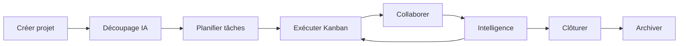
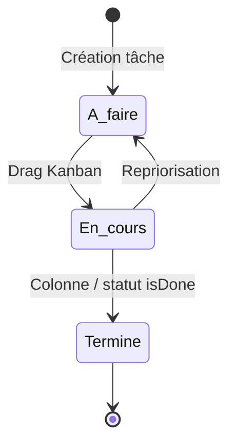

# Workflow projet — WorkPilot

Ce document décrit le **parcours complet d'un projet** dans WorkPilot : ce que fait l'utilisateur, ce que le système déclenche automatiquement, et **quelle action doit suivre** à chaque étape.

> Philosophie : **Moins de clics. Plus d'automatisation.**

---

## 1. Vue d'ensemble

| Étape | Objectif | Automatisations clés |
|-------|----------|----------------------|
| **Création** | Cadrer le projet | Colonnes Kanban, event `project.created`, job IA |
| **Planification** | Rendre le travail actionnable | Découpage IA, échéances, calendrier |
| **Exécution** | Avancer visuellement | Progression %, drag & drop, Focus Mode |
| **Collaboration** | Aligner l'équipe | Commentaires, activités, notifications WS |
| **Intelligence** | Réduire la charge mentale | Daily Brief, Smart Reminders, assistant |
| **Clôture** | Terminer proprement | Statut terminé, archivage (manuel) |

---

## 2. Cycle de vie détaillé

### Étape 0 — Onboarding workspace

| | |
|---|---|
| **Action utilisateur** | S'inscrire → workspace créé **ou** accepter une invitation |
| **Invitation (compte existant)** | Notification dans la cloche → **Accepter** en un clic |
| **Invitation (nouveau compte)** | Lien `/invite/:token` → création de compte ou connexion |
| **Partage projet** | Bouton **Partager** sur un projet → email + rôle Lecteur/Éditeur/Admin |
| **Email inconnu** | Invitation combinée (workspace GUEST + accès projet) → lien `/invite/:token` |
| **Multi-workspace** | Sélecteur dans la sidebar ; dernier workspace mémorisé au login |
| **Système** | Membres OWNER/ADMIN/MEMBER voient tout ; GUEST voit les projets partagés |
| **Action suivante** | Créer le premier projet ou consulter le Dashboard |

---

### Étape 1 — Création du projet

| | |
|---|---|
| **Où** | `/app/projects` → **Nouveau projet** |
| **Action utilisateur** | Saisir nom (+ description optionnelle) |
| **Système** | Crée le projet + 3 colonnes Kanban : *À faire*, *En cours*, *Terminé* |
| **Event bus** | Publie `project.created` |
| **IA (auto)** | Job `PROJECT_BREAKDOWN` → suggestions de tâches initiales |
| **WebSocket** | `ai.job.completed` quand le job est terminé |
| **Action suivante** | Ouvrir le projet → **Découper avec l'IA** → **Créer X tâches** |

---

### Étape 2 — Planification des tâches

| | |
|---|---|
| **Où** | Fiche projet → bloc IA, ou création manuelle sur le Kanban |
| **Action utilisateur** | Valider les tâches suggérées par l'IA ou en ajouter manuellement |
| **Système** | Tâches placées dans la première colonne ; progression projet recalculée |
| **Recommandé** | Définir **priorité** et **date d'échéance** sur les tâches critiques |
| **Calendrier** | Les tâches avec `dueDate` apparaissent dans `/app/calendar` |
| **Action suivante** | Assigner / prioriser → passer en **Exécution** |

**Actions IA disponibles (manuelles)**

| Action | Endpoint / UI | Résultat |
|--------|---------------|----------|
| Découper le projet | Bouton *Découper avec l'IA* | Liste de tâches suggérées |
| Analyser un risque | `POST .../ai/tasks/:id/risk` | Score de risque + suggestion |
| Assistant | `/app/assistant` | Conseils contextuels (OpenAI ou mock) |

---

### Étape 3 — Exécution (Kanban)

| | |
|---|---|
| **Où** | `/app/projects/:id` — tableau Kanban |
| **Action utilisateur** | Glisser-déposer une tâche entre colonnes |
| **Système** | Met à jour `listId` + `position` ; synchronise le statut ; recalcule **progression %** |
| **Statut terminé** | Si le statut de la tâche a `isDone: true` → `completedAt` renseigné |
| **Focus Mode** | Démarrer le focus sur une tâche → `/app/focus` (chrono + checklist) |
| **Action suivante** | Commenter / joindre un fichier si blocage → ou marquer **Terminé** |

---

### Étape 4 — Collaboration

| | |
|---|---|
| **Où** | Panneau latéral tâche (clic sur une carte) |
| **Actions utilisateur** | Commentaire, pièce jointe, consultation activité |
| **Système** | Enregistre `Activity` ; notifie les watchers ; WS temps réel |
| **Events WS** | `comment.created`, `activity.new`, `notification.new` |
| **Action suivante** | Reprendre l'exécution ou ajuster le planning |

---

### Étape 5 — Intelligence quotidienne

| | |
|---|---|
| **Dashboard** | `/app` — widgets stats + fil d'activité |
| **Daily Brief** | Tâches critiques, réunions, retards, objectif du jour |
| **Smart Reminders** | Sync → analyse charge → propositions : *Commencer*, *Décaler*, *Ignorer* |
| **Recherche** | `⌘K` / `Ctrl+K` — projets, tâches, personnes, commentaires |
| **Action suivante** | Traiter les rappels → Focus sur la tâche prioritaire |

**Parcours matinal recommandé**

1. Ouvrir le **Dashboard** → lire le **Daily Brief**
2. Lancer **Sync** sur les Smart Reminders
3. `⌘K` → accéder rapidement à la tâche du jour
4. **Focus Mode** sur la tâche principale

---

### Étape 6 — Calendrier & réunions

| | |
|---|---|
| **Où** | `/app/calendar` |
| **Action utilisateur** | Créer une réunion ou consulter les échéances de tâches |
| **IA** | Bouton **Résumer** sur une réunion → job `MEETING_SUMMARY` |
| **Résultat IA** | Résumé + points clés + tâches de suivi suggérées |
| **Action suivante** | Créer les tâches de suivi dans le projet concerné |

---

### Étape 8 — Paramètres & intégrations

| | |
|---|---|
| **Où** | `/app/settings` |
| **IA** | Affiche le provider actif (mock ou OpenAI) |
| **Webhooks** *(admin)* | URL + événements → signature HMAC `X-WorkPilot-Signature` |
| **Events disponibles** | `project.created`, `task.updated`, `*` (tous) |
| **Action suivante** | Connecter Slack, n8n ou votre backend pour automatiser |

---

### Étape 7 — Clôture & archivage

| | |
|---|---|
| **Critère de clôture** | Toutes les tâches en colonne *Terminé* → progression = 100 % |
| **Action utilisateur** | Bouton **Archiver** sur la fiche projet ; consulter via **Projets archivés** |
| **Action suivante** | Rétrospective légère via l'assistant IA ou nouveau projet |

---

## 3. Automatisations (Event Bus → IA)

| Event domaine | Déclencheur actuel | Action automatique | Action utilisateur attendue |
|---------------|-------------------|--------------------|----------------------------|
| `project.created` | Création projet | Job `PROJECT_BREAKDOWN` | Appliquer les tâches suggérées |
| `task.updated` | Mise à jour / déplacement tâche | Dispatch webhooks | Automatisations externes |
| `meeting.ended` | *(prévu)* | Job `MEETING_SUMMARY` | Valider résumé + tâches suivi |
| `task.overdue` | Retard détecté *(prévu)* | Job `TASK_RISK` | Ajuster échéance / priorité |
| `user.message` | Chat assistant | Job `ASSISTANT` | Suivre les suggestions |

**Implémentation actuelle** : bus in-memory (dev) ; production prévue Redis Streams / BullMQ.

---

## 4. Notifications & temps réel

| Event WebSocket | Effet UI |
|-----------------|----------|
| `notification.new` | Cloche — badge non lu |
| `comment.created` | Rafraîchit commentaires tâche |
| `activity.new` | Rafraîchit fil d'activité dashboard |
| `ai.job.completed` | Rafraîchit jobs IA + assistant |

---

## 5. Rôles & responsabilités (cible)

| Rôle | Actions principales |
|------|---------------------|
| **Owner / Admin** | Créer projets, config workspace, inviter membres |
| **Member** | Exécuter tâches, commenter, Focus, calendrier |
| **Guest** | Accès aux projets partagés (Lecteur / Éditeur / Admin projet) |

---

## 6. Checklist « Projet bien lancé »

- [ ] Projet créé avec description claire
- [ ] Tâches IA appliquées ou backlog manuel défini
- [ ] Au moins 3 tâches avec échéance
- [ ] Daily Brief consulté chaque matin
- [ ] Smart Reminders synchronisés 1×/jour
- [ ] Réunions résumées → tâches de suivi créées
- [ ] Progression > 0 % — équipe alignée via commentaires

---

## 7. Évolutions prévues (post Phase 6)

| Priorité | Feature | Impact workflow |
|----------|---------|-----------------|
| P1 | LLM réel (OpenAI) | ✅ `AI_PROVIDER=openai` + clé API |
| P1 | Event `task.updated` → webhooks | ✅ Dispatch sur mise à jour / déplacement |
| P1 | Event `task.updated` → analyse risque auto | Moins de retards non détectés |
| P2 | Archivage projet UI | ✅ Bouton Archiver + liste archivés |
| P2 | Invitations membres | ✅ `/app/team` + lien `/invite/:token` |
| P2 | Partage projet email inconnu | ✅ Invitation combinée workspace + projet |
| P3 | Sprints & roadmap | Planification par timebox |
| P3 | Intégrations (Slack, Google Calendar) | Réunions & notifications externes |

---

## 8. Références techniques

- [Architecture](./ARCHITECTURE.md) — bounded contexts, event bus, IA
- [Conventions](./CONVENTIONS.md) — nommage events (`project.created`, etc.)
- API Swagger : `http://localhost:3000/docs` — routes `/ai/*`, `/projects/*`, `/tasks/*`
